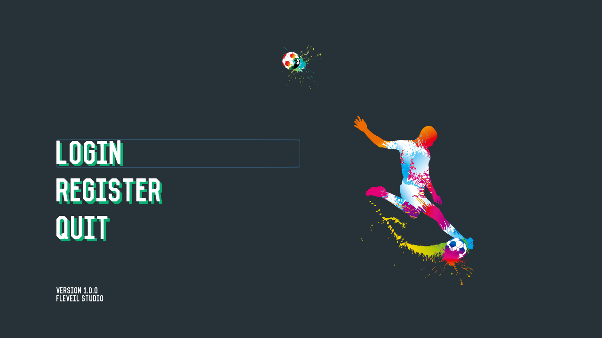
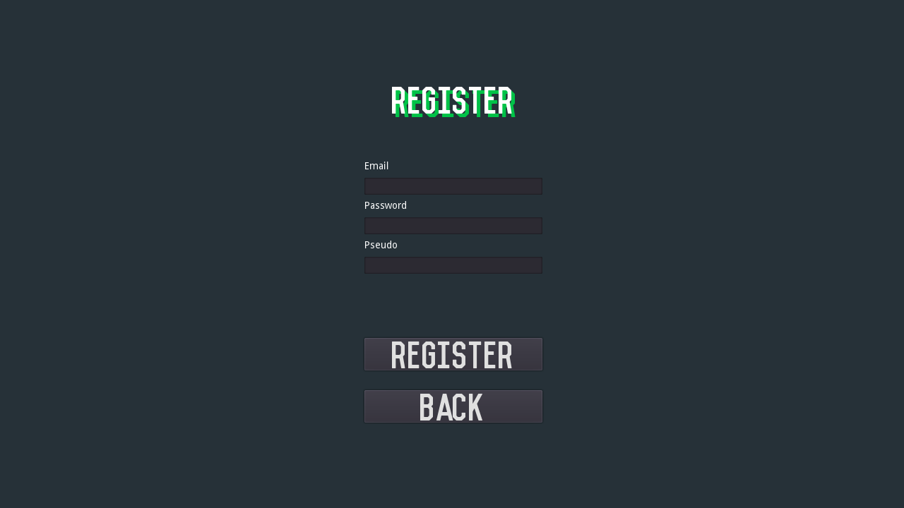
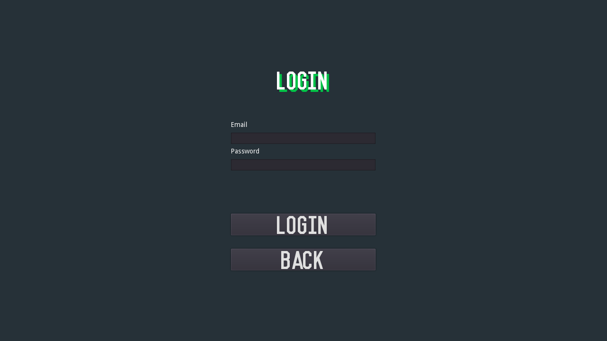
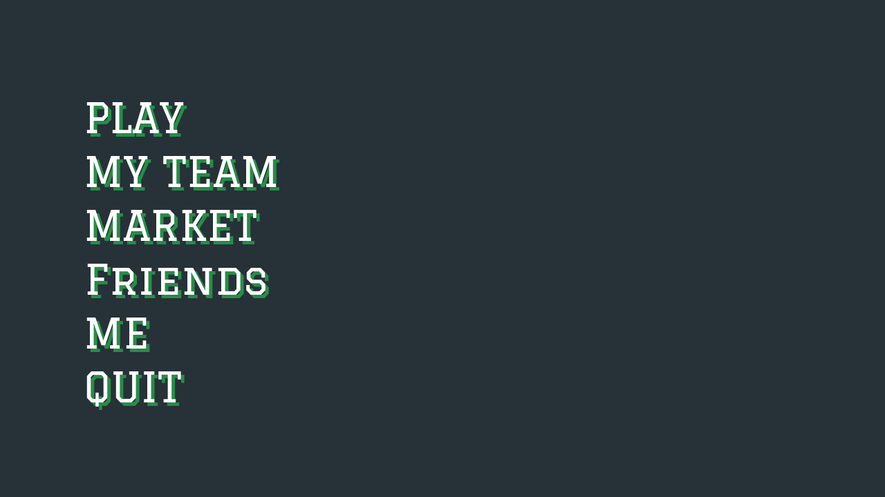
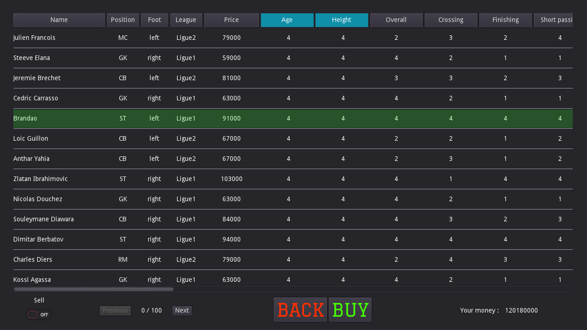
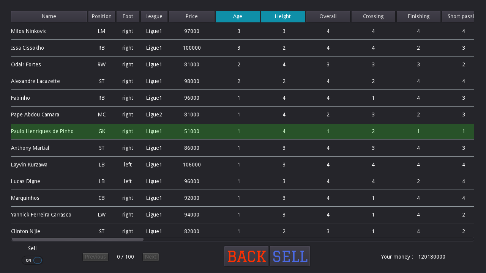
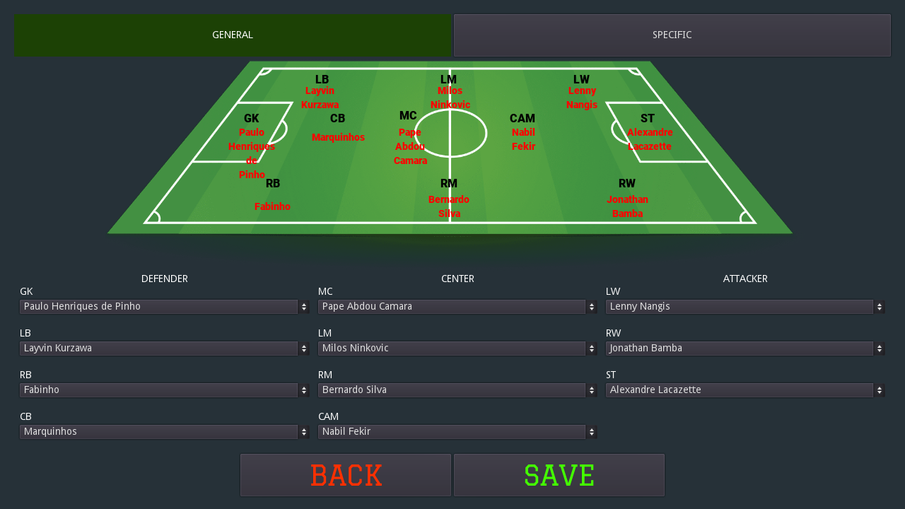
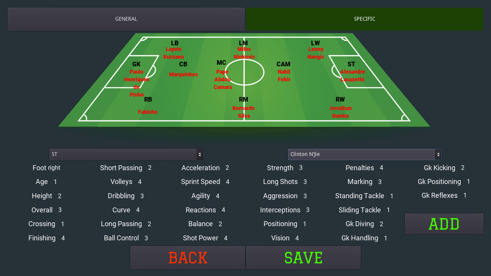
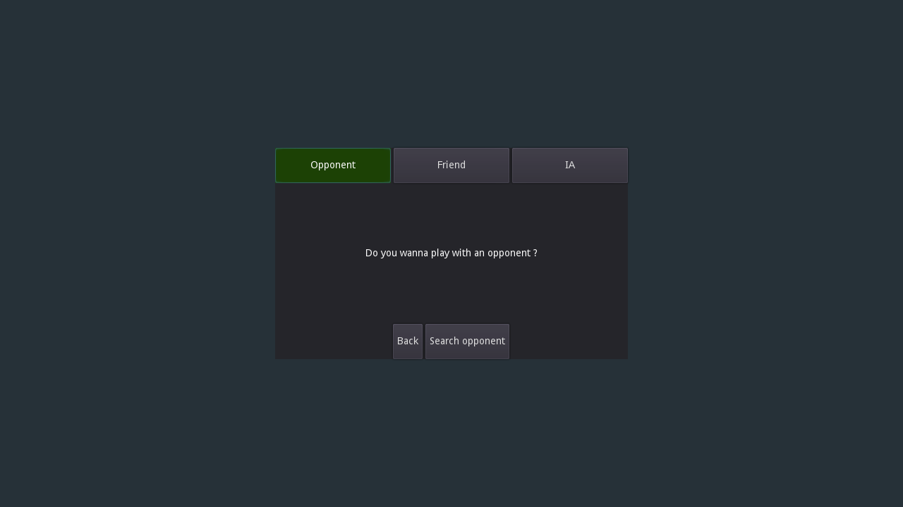
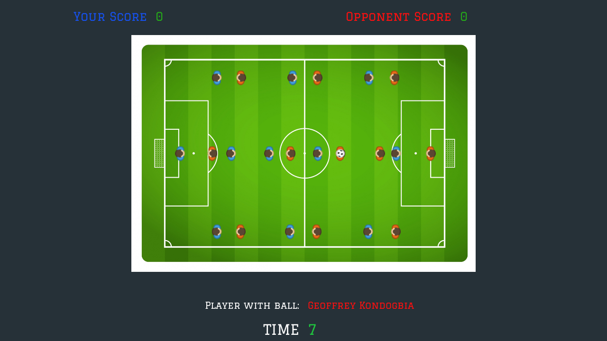

# FOOTBALLPROJECT_SCHEDULER

## Pour tester le projet

1. Cloner le repo
2. Installer les requirements via pip: "pip install -r requirements.txt"
3. Installer MongoDB et Redis
4. Démarrer un serveur MongoDB sur 127.0.0.1:27017 et démarrer Redis.
5. Exécuter le script pour avoir tout les joueurs en BDD: "sudo python3 ./player/script_make_players.py" (être dans le même dossier que le script)
6. Démarrer le Scheduler en faisant "./run"

Le serveur est lancé, plus qu'a lancer le client :)
Pour cela RDV sur ce dépo: https://github.com/FlorianLeveil/FOOTBALLPROJECT_UI

## Screens

### Welcome

### Register

### Login

### Main

### Market
* BUY

* SELL

### Friends

### My Team
* GENERAL

  
* SPECIFIC

### PLAY
* PLAY VERSUS OPPONENT

  

### Match

  
