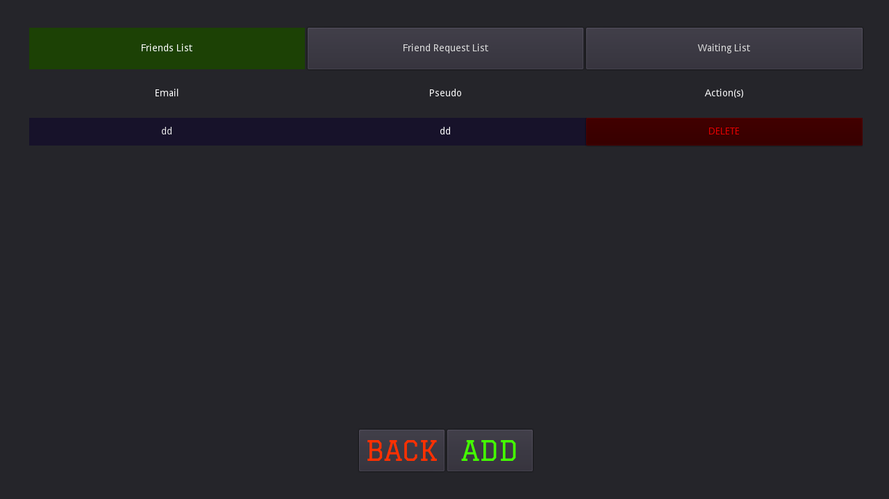

# FOOTBALLPROJECT_SCHEDULER

## Pour tester le projet

1. Cloner le repo
2. Installer les requirements via pip: "pip install -r requirements.txt"
3. Démarrer un serveur MongoDB sur 127.0.0.1:27017
4. Exécuter le script pour avoir tout les joueurs en BDD: "sudo python3 ./player/script_make_players.py"
5. Démarrer le Scheduler en faisant "./run"

## Screens

### Welcome

### Register

### Login

### Main

### Market
* BUY

* SELL

### Friends

### My Team
* GENERAL
  

  
* SPECIFIC

